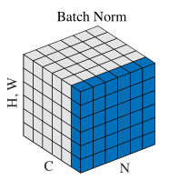
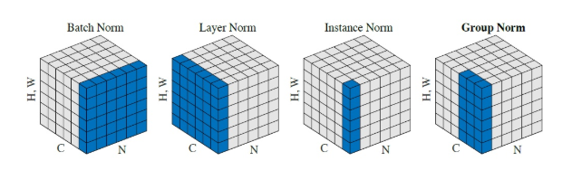

# 深度学习中的标准化(Normalization)

## 深度网络训练的问题

假设网络没有非线性函数，不考虑偏置项，设每层网络层输入为$x^{(k-1)} \in R^{n_{k-1}}$,参数为$W^{(k)}\in R^{n_kn_{k-1}}$,输出为$x^{(k)}\in R^{n_{k-1}}$,每一层的操作是
$$
x^{(k)}=W^{(k)}x^{(k-1)}\\
= W^{(k)}W^{(k-1)}...W^{(1)}x^{(0)}
$$

### 梯度消失

设$W=(0.5)$的元素值小于1，此时随着层数k的不断增加，w不断减少最终接近于0使得梯度下降非常缓慢造成梯度消失。

### 梯度爆炸

设$W=(1.5)$的元素值大于1，此时随着层数k的不断增加，w不断增加最终接近于正无穷。使得梯度下降过大造成梯度爆炸。

使用激活函数可以限制每层输出值得输出范围在一定程度上消除梯度消失和梯度爆炸的影响。但是目前的激活函数中Sigmoid激活函数在经过多层后输出值会落在饱和区。从而减慢训练，ReLU激活函数克服了Sigmoid的缺点，增加了网络的稀疏性，但没有很好的解决梯度消失和梯度爆炸的影响。

## Batch Normalization

在同一个batch中的不同样本相同对应位置进行归一化。（将原有落在饱和区间的数据分布到标准正态分布上）

标准化公式为
$$
\hat{x_i}=\frac{1}{\sigma _i}(x_i-\mu _i) \tag{1}
$$
其中
$$
\mu _i = \frac{1}{m}\sum_{k\in S_i}x_k, (均值)\\
\sigma _i = \sqrt{\frac{1}{m}\sum_{k\in S_i}(x_k-\mu _i)^2 +\epsilon} ,(方差)
$$
其中$\epsilon$是一个很小的正值，比如$10^{-8}$,这样可以强制避免$\sqrt{z}$ 的梯度在z=0时未定义的问题。在测试阶段$\mu$和$\sigma$可以被替换为训练阶段收集的运行均值。这使得模型可以对单一样本评估，而无需使用定义与整个小批量的$\mu$和$\sigma$。

直接使用标准化公式会导致网络表达能力下降，为了防止这一点，每个神经元增加两个调节参数（scale和shift），这两个参数是通过训练来学习到的，用来对变换后数据再变换，使得网络表达能力增强，即对变换后的数据进行如下的scale和shift操作：
$$
y^{(k)}=\gamma ^{(k)}\hat{x}^{(k)}+\beta ^{(k)} \tag{2}
$$

通过公式（1）我们可以将输入数据分布到均值为1，方差为0的标准正态分布上。但是这样的操作会使得BN层后面的神经元无论怎么学习都会统一缩放到这一区域。使用公式（2）可以将经过标准化的数据分布到均值为$\beta$方差为$\gamma ^2$的区间上，而$\beta$和$\gamma$两个参数与其他训练参数相同，通过梯度下降的方式学得。这样BN层便能将输入数据缩放至最适合该神经元的区间（分布）上。
在卷积神经网络中，数据维度为（N,C,H,W）

卷积层上的BN使用了类似权值共享的策略，把一整张特征图当做一个神经元进行处理。卷积神经网络经过卷积后得到的是一系列的特征图，网络某一层输入数据可以表示为四维矩阵(N,C,H,W)。在CNN中我们可以把每个特征图看成是一个特征处理（一个神经元），因此在使用Batch Normalization，mini-batch size 的大小就是：NHW，于是对于每个特征图都只有一对可学习参数：$\beta$和$\gamma$。相当于求取所有样本所对应的一个特征图的所有神经元的平均值、方差，然后对这个特征图神经元做归一化。

PyTorch中BatchNorm2d的实现公式
$$
y = \frac{x - \mathrm{E}[x]}{ \sqrt{\mathrm{Var}[x] + \epsilon}} * \gamma + \beta
$$

#### 优点

* 训练速度更快。因为网络的数据分布更加稳定，模型更易训练。

* 使用更大的学习率。因为网络的数据分布稳定，使用更大的学习率不会轻易造成损失函数曲线发散。能够加快训练的收敛速度。

* 不需要太关注模型参数的初始化。模型的随机初始化结果对模型的训练没有太大影响。

* 正则化效果。使用mini-batch的统计值近似训练数据的统计值，使得BN层具有正则化的效果

#### 缺点

* BN依赖于batch size, 对batch size敏感。当batch size太小时， batch的统计值不能代表训练的统计值，使得训练过程更加困难
* 在迁移学习fine-tune阶段，模型的BN层参数固定不变，这是不合理的因为迁移学习的预训练数据集和目标数据集有非常大的不同
* 不能用于测试阶段。测试阶段使用训练集的统计值取近似测试集的统计值是不合理的。

## Group Normalization

针对BN的一些缺点，Group Normalization 对channel进行分组，对每组channel进行Normalization

