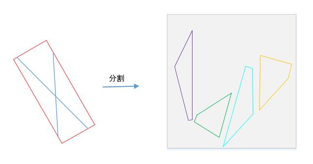

## 云从科技(clouldwalk)

### 题目一

#### 题目描述

输入一个数组，输出最长升序子序列的长度。

#### 输入描述

一组数组，长度不大于$10^5$.

#### 输出描述

一个整数，最长升序子序列的长度。

#### 示例

输入：	

```
5,1,4,2,3
```

输出：	

```
3
```


#### 实现代码

```python
def LIS(arr):
    l = len(arr)
    temp_arr = []
    if l == 0:
        return 0
    elif l == 1:
        return 1
    else:
        temp_arr.append(arr[0])
        for i in range(1, l):
            if arr[i] <= temp_arr[0]:
                temp_arr[0] = arr[i]
            elif (temp_arr[0] < arr[i]) and (arr[i] <= temp_arr[-1]):
                low, high = 0, len(temp_arr)-1
                while low <= high:
                    mid = (low+high)//2
                    if temp_arr[mid] >= arr[i]:
                        temp_arr[mid] = arr[i]
                        break
                    else:
                        low = mid + 1
            elif arr[i]>temp_arr[-1]:
                temp_arr.append(arr[i])
        return len(temp_arr)


s = input()
arr = s.split(',')
print(LIS(arr))
```

结果通过60%

### 题目二

#### 题目描述

有四个四边形，已确定他们来源于一个矩形的切块，切块规则是，两根切割直线分别过矩形的两个对立边，把矩形切割成四块，并都满足一下前提条件：

（1）切割直线不会经过矩形顶点；

（2）切割直线与矩形边不垂直；

（3）两切割线不相互垂直；

（4）切割得到的四个边长度两两不等；

切割示例如图所示



现在已知被切好的四个四边形的各个顶点坐标，求矩阵的长和宽

#### 输入描述

四个四边形的顶点坐标（确保是构成矩形，每四行代表一个四边形的四个顶点，顺时针顺序），如下所示

x00,y00

x01,y01

x02,y02

x03,y03

x10,y10

x11,y11

x12,y12

x13,y13

.

.

.

#### 输出描述

长和宽a，b，确保a>=b

输出按四舍五入取整至个位。

#### 示例

输入

```
50,500
95.3333,500
114.755,265.303
50,234,286
220,500
220,315.714
114.755,265.303
95.3333,500
220,50
132.571,50
114.755,265.303
220,315.714
50,50
50,234.286
114.755,265.303
132.571,50
```

输出

```
450,170
```

#### 实现代码


### 题目三

#### 题目描述

某个序列的子序列是从最初序列通过去除某些元素但不破坏余下元素的相对位置（在前或在后）而形成的新序列。现在给出两个字符串S1和S2（字符串只包含小写字母），请判断S2是否为S1的子序列。

#### 输入描述

输入两行

第一行表示字符串S1

第二行表示字符串S2

#### 输出描述

如果S2为S1的子序列，输出

1

否则，输出

0

#### 示例1

输入

```
abcdefa

aca
```

输出

```
1
```


#### 示例2

```
abcdefa

aac
```

输出

```
0
```


#### 实现代码

```python
def strline(str1,str2):
    if not str1 or not str2:
        return 0
    temp = 0
    for i in range(len(str2)):
        item = str2[i]
        try:
            item1 = str1.index(item, temp)
        except:
            return 0
        temp = item1 + 1
    return 1


str1 = input()
str2 = input()
print(strline(str1, str2))
```

通过率100%