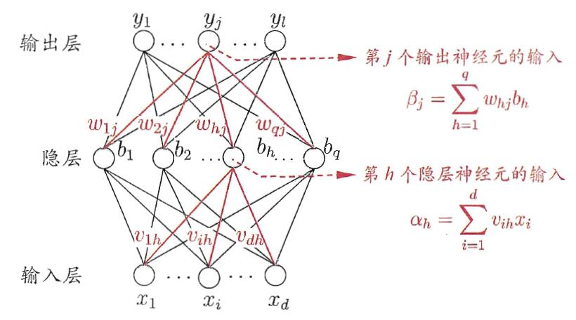

# 误差逆传播算法

摘自机器学习-西瓜书-周志华

部分内容为个人理解

给定训练集$D={(x_1,y_1),(x_2,y_2),...,(x_m,y_m)},x_i \in R^d,y_i\in R^l$,即输入示例由$d$个属性描述，输出$l$维实值向量。多层前馈网络结构拥有$d$个输入神经元、$l$个输出神经元、$q$个隐层神经元，其中输出层第$j$个神经元的阈值用$\theta_j$表示，隐层第$h$个神经元的阈值用$\gamma_h$表示。输入层第$i$个神经元与隐层第$h$个神经元之间的连接权（权重）为$\nu_{ih}$，隐层第$h$个神经元与输出层第$j$个神经元之间的连接权为$\omega_{hj}$。记隐层第$h$个神经元接收到的输入为$\alpha_h=\sum_{i=1}^d\nu_{ih}x_i$,输出层第$j$个神经元接收到的输入为$\beta_j=\sum_{h=1}^q\omega_{hj}b_h$,其中$b_n$为隐层第$h$个神经元的输出。假设隐层和输出层神经元都是用$Sigmoid$函数。对训练例$(x_k,y_k)$，假定神经网络的输出为$\hat y_k = (\hat y^k_1,\hat y^k_2,...,\hat y^k_l)$,即
$$
\hat y^k_j = f(\beta_j - \theta_j) \tag{1}
$$
则网络在$（x_k，y_k）$上的均方误差为
$$
E_k=\frac{1}{2} \sum^l_{j=1}({\hat y^k_j} - y^k_j)^2 \tag{2}
$$

## 前项传播过程

输入层输入 $x_1,x_2,...,x_m$

隐层输入 $\alpha_h=\sum_{i=1}^d\nu_{ih}x_i$

隐层输出$b_h= f(\alpha_h-\gamma_h)$

输出层输入 $\beta_j=\sum_{h=1}^q\omega_{hj}b_h$

输出层输出 $\hat y^k_j = f(\beta_j - \theta_j)$

其中$f(\cdot)$为激活函数，文中使用$Sigmoid$函数

$Sigmoid(x) = \frac{1}{1+e^{-x}}$

## 参数计算

网络中需要计算的参数总数为$(d+l+1)q+l$,输入层到隐层的$d\times q$个权重值，隐层到输出层的$q\times l$个权重值，$q$个隐层神经元的阈值、$l$个输出层神经网络的阈值。

## 反向传播过程

任意参数$\nu$的更新估计式为
$$
\nu \gets \nu + \Delta\nu
$$
BP算法基于梯度下降策略，以目标的负梯度方向对参数进行调整，对式(2)的误差$E_k$，给定学习率$\eta$,有
$$
\Delta\omega_{hj} = -\eta \frac{\partial E_k}{\partial\omega_{hj}} \tag{3}
$$
注意到$\omega_{hj}$先影响到$j$个输出层神经元的输入值$\beta_j$，在影响到其输出值$\hat y^k_j$,然后在影响到$E_k$,有
$$
\frac{\partial E_k}{\partial\omega_{hj}} = \frac{\partial E_k}{\partial\hat y^k_j}\cdot\frac{\partial \hat y^k_j}{\partial\beta_j}\cdot\frac{\partial \beta_j}{\partial\hat y^k_j} \tag{4}
$$
根据$\beta_j$的定义显然有
$$
\frac{\partial \beta_j}{\partial\hat y^k_j} = b_n \tag{5}
$$

$Sigmoid$函数有一个很好的性质：
$$
f^{'}(x)=f(x)(1-f(x))
$$
令$g_j=-\frac{\partial E_k}{\partial\hat y^k_j}\cdot\frac{\partial \hat y^k_j}{\partial\beta_j}$ ,则
$$
\begin{aligned}
g_j&=-\frac{\partial E_k}{\partial\hat y^k_j}\cdot\frac{\partial \hat y^k_j}{\partial\beta_j} \\
&=-(\hat y^k_j-y^k_j)f^{'}(\beta - \theta_j)\\
&= \hat y^k_j(1-\hat y^k_j)(y^k_j-\hat y^k_j) 
\end{aligned}\tag{6}
$$
将式(6)和式(5)代入式(4)，再代入式(3)可以得到：
$$
\Delta\omega_hj = \eta g_jb_h
$$
类似的可以得到
$$
\Delta\theta_j=-\eta g_j
$$

$$
\Delta \nu_ih = \eta e_hx_i
$$

$$
\Delta\gamma_h=-\eta e_h
$$

其中
$$
\begin{aligned}
e_h&=-\frac{\partial E_k}{\partial b_h}\cdot\frac{\partial b_h}{\partial\alpha_h}\\
&=-\sum^l_{j=1}\frac{\partial E_k}{\partial \beta_j}\cdot\frac{\partial \beta_j}{\partial b_h}f^{'}(\alpha_h-\gamma_h)\\
&=\sum^l_{j=1}\omega_{hj}g_jf^{'}(\alpha_h-\gamma_h)\\
&=b_h(1-b_h)\sum^l_{j=1}\omega_{hj}g_j
\end{aligned}
$$
