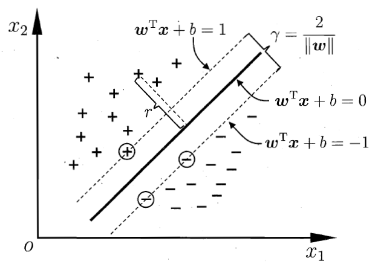

## 支持向量机（SVM）

推荐讲解视频 [白板推导](https://www.bilibili.com/video/av28186618?from=search&seid=9446689980433433378)

支持向量机的思想是寻找样本分类的最大间隔。

设样本$D=\{(x_1,y_1),(x_1,y_1),...,(x_m,y_m)\}$,其中$y_i \in \{+1,-1\}$,当$x_i$为正例时$y_i=+1$，当$x_i$为反例时，$y_i=-1$.

### 线性可分支持向量机

线性可分支持向量机是最基本的支持向量机，分类超平面为

$$
w^Tx+b=0 \tag{1}
$$

当样本点为正例时$w^Tx_i+b\ge 0,y_i=+1$,当样本点为反例时$w^Tx_i+b\le 0,y_i=-1$,因此
$$
y_i(w^Tx_i+b)\ge 1 \tag{2}
$$
样本点到超平面的距离
$$
r_i=\frac{|w^tx_i|+b}{||w||}
$$
两个边界之间的距离为
$$
r=\frac{2}{||w||}
$$
要获得最大间隔即求最大的r，
$$
\begin{aligned}
& \max_{w,b}\quad \frac{2}{||w||}\\
& s.t.\quad y_i(w^Tx_i+b)\ge 1,\quad i=1,2,...,m
\end{aligned}
$$
转化为最小化问题即
$$
\begin{aligned}
& \min_{w,b}\quad \frac{1}{2}{||w||^2}\\
& s.t.\quad y_i(w^Tx_i+b)\ge 1,\quad i=1,2,...,m
\end{aligned} \tag{3}
$$
式(3)即为支持向量机的基本型优化问题。

求得最优化问题的结$w^*,b^*$,得到线性可分支持向量机，分离超平面为
$$
w^*x+b^*=0
$$
分类决策函数为
$$
f(x)=sign(w^*x+b^*)
$$

### 对偶问题

式(3)的拉格朗日乘子式是
$$
L(w,b,\lambda)=\frac{1}{2}{||w||^2}+\sum_{i=1}^{m}{\lambda_i(1-y_i(w^Tx_i+b))} \tag{4}
$$

对式(4)中$w,b$分别求偏导可得
$$
\frac{\partial L}{\partial b}=-\sum_{i=1}^m\lambda_i y_i\\
\frac{\partial L}{\partial w}=w-\sum_{i=1}^m\lambda_iy_ix_i
$$
令$\frac{\partial L}{\partial b},\frac{\partial L}{\partial w}$为0可求得
$$
\sum_{i=1}^m\lambda_i y_i=0\\
w=\sum_{i=1}^m\lambda_iy_ix_i \tag{5}
$$
将式(5)代入$L(w,b,\lambda)$中可得
$$
\begin{aligned}
L(w,b,\lambda)&=\frac{1}{2}\sum_{i=1}^m\sum_{j=1}^m{\lambda_i\lambda_jy_iy_ix_i^Tx_i}+\sum_{i=1}^{m}\lambda_i-\sum_{i=1}^m\sum_{j=1}^m{\lambda_i\lambda_jy_iy_ix_i^Tx_i}\\
&=\sum_{i=1}^{m}\lambda_i-\frac{1}{2}\sum_{i=1}^m\sum_{j=1}^m{\lambda_i\lambda_jy_iy_ix_i^Tx_i}
\end{aligned}
$$
即原问题式(3)的对偶问题为
$$
\begin{aligned}
\max_\lambda \quad & \sum_{i=1}^{m}\lambda_i-\frac{1}{2}\sum_{i=1}^m\sum_{j=1}^m{\lambda_i\lambda_jy_iy_ix_i^Tx_i}\\
s.t.,\quad & \sum_{i=1}^m\lambda_i y_i\quad=0\\
&\lambda_i\ge0, \quad i=1,2,...,m
\end{aligned} \tag{6}
$$
注：此问题符合强对偶关系即
$$
\min_{w,b}\max_\lambda L(w,b,\lambda)= \max_\lambda \min_{w,b} L(w,b,\lambda)
$$

注：$强对偶关系\Leftrightarrow KKT$

设$\lambda^*,w^*,b^*$为最优解则有KKT条件：
$$
\lambda_i^*(y_i(w^{*T}x+b^*)-1)=0 \\
y_i(w^{*T}x+b^*)-1\ge 0\\
\lambda_i^*\ge 0
$$
其中$w^*=\sum_{i=1}^m\lambda_i^* y_ix_i$,$b^*=y_i-\sum_{i=1}^m\lambda_i^*y_ix_i^Tx_j$

### 软间隔

在线性可分支持向量机中假设所有的样本能够完全被超平面加以区分，但实际的数据中会存在误差，解决这些误差的方法为使用损失函数。

最直接的损失函数为“0/1”损失函数，正确项为0，错误项为1，此时优化目标变为
$$
\min_{w,b}\quad  \frac{1}{2}w^Tx +C\sum_{i=1}^m \ell_{0/1}(y_i(w^Tx_i+b)-1)
$$
其中$C$为缩放系数（超参数），$\ell_{0/1}$为0/1损失函数。

由于$\ell_{0/1}$不具有连续性，因此一般使用其他损失函数代替$\ell_{0/1}$。

hinge（合页）损失：$\ell_{hinge}=max\{0,(y_i(w^Tx_i+b)-1)\}$

引入松弛变量$\xi$，优化目标变为
$$
\begin{aligned}
\min_{w,b,\xi}\quad &\frac{1}{2}||w||^2+C\sum_{i=1}^m \xi_i\\
s.t. \quad &y_i(w^Tx_i+b)-1\ge\xi_i,\\
& \xi_i\ge0 	
\end{aligned}\tag{7}
$$
其对偶问题为
$$
\begin{aligned}
\max_\lambda \quad & \sum_{i=1}^{m}\lambda_i-\frac{1}{2}\sum_{i=1}^m\sum_{j=1}^m{\lambda_i\lambda_jy_iy_ix_i^Tx_i}\\
s.t.,\quad & \sum_{i=1}^m\lambda_i y_i\quad=0\\
&C\ge\lambda_i\ge0, \quad i=1,2,...,m
\end{aligned} \tag{8}
$$

### 非线性支持向量机

通过非线性变换将样本转换到高维空间中在进行线性分类。在线性支持向量机学习的对偶问题中，目标函数只涉及样本间的内积，即$x_i^T x_j$。假设映射函数为$\phi(x)$，则在高维空间中样本间内积为$\phi(x_i^T)\phi(x_j)$。令
$$
K(i,j)=\phi(x_i^T)\phi(x_j)
$$
即用核函数$K(i,j)$代替原有内积。非线性支持向量机通过核化得到核线性判别分析（KLDA）。